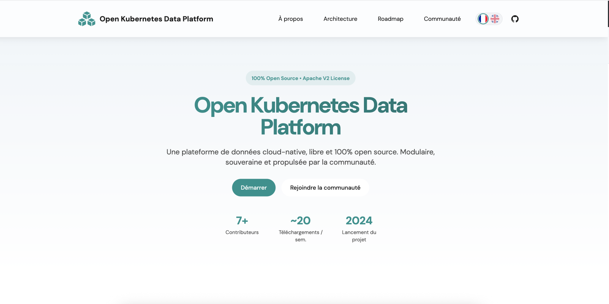
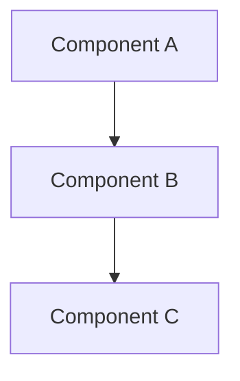

# OKDP README Template — Documentation Audit Canvas

> **Purpose:** This document is a common canvas for auditing and improving documentation across all OKDP repositories.
> It was agreed upon during a team workshop (June 2026) and lives in [OKDP/OKDP](https://github.com/OKDP/OKDP) as the reference.
>
> **How to use it:**
> - Use the [Section Reference Table](#section-reference-table) to audit an existing README.
> - Use the [Full Template](#full-template) as a starting point when writing or rewriting a README.
> - Remove all annotation comments (`<!-- ... -->`) before publishing.
> - Sections marked **[CONDITIONAL]** apply only to specific repo types. Sections marked **[OPTIONAL]** apply to all repo types but are not required.

---

## Section Reference Table

| # | Section | Required? | Repo type | What to audit / check |
|---|---------|:---------:|-----------|------------------------|
| 0 | Visual header (screenshot or OKDP banner) | Conditional | All | Does the component expose a web interface? If yes: is there a screenshot stored in `docs/assets/`? If not: is the section omitted or replaced with an OKDP-branded banner? **Never use upstream project logos** (trademark restrictions). |
| 1 | Badges | **Mandatory** | All | Are the minimum required badges present and links working? Minimum set: CI status, latest release, Apache 2.0 license. Add extras only if relevant (e.g. upstream version, package registry). Use [shields.io](https://shields.io) to generate custom badges. |
| 2 | Project name + one-line description | **Mandatory** | All | Clear to someone unfamiliar with the tool? |
| 3 | What does this project provide? | **Mandatory** | All | Are **both motivation levels** addressed? (1) Upstream gap: what does the upstream not provide that justifies this packaging? (2) Platform role: why did OKDP choose to include this component — what role does it play in the platform and what depends on it? Are delivered artifacts listed (image/chart/SDK)? Are OKDP-specific additions highlighted? |
| — | Alternatives (sub-section) | Optional | All | Are competing/upstream tools mentioned? |
| 4 | Architecture diagram | **Mandatory** | Helm, Image+Chart, Sandbox | Is a diagram present? Format: Mermaid, draw.io SVG, or Excalidraw SVG? Does it reflect the **OKDP deployment scenario** (not just upstream)? Is there a note explaining OKDP-specific choices and clarifying that other options exist? Is there a link to the upstream architecture docs? |
| 5 | Prerequisites | **Mandatory** | All | Are versions, tools, credentials all listed explicitly? Is there a **"Tested with"** subsection showing exact validated versions (not just ranges)? |
| 6 | Quick start | Conditional | Helm, Image+Chart, Sandbox | Is it the shortest path to a meaningful first result? Is an expected result shown? |
| 7 | Installation (full, step-by-step) | **Mandatory** | All | Every step has a command + expected result? |
| 8 | Configuration | Conditional | Helm, Image+Chart, SDK | Is there a parameter table? For Helm repos: is it separated from auto-generated chart values? |
| 9 | Usage examples | Conditional | SDK, Examples | Are examples realistic? Do they show expected output? |
| 10 | Images / Components | Conditional | Image, Image+Chart | Tag format documented? `quay.io/okdp` link present? |
| 11 | OKDP Integration | **Mandatory** | All | Is the component's integration in the OKDP ecosystem briefly mentioned? |
| 12 | Troubleshooting | **Mandatory** | Helm, Image+Chart, Sandbox | Are the most common errors documented with symptom → cause → fix? |
| 13 | Contributing / Development | Optional | All | Dev setup, build, and test — each with expected result? Points to CONTRIBUTING.md? |
| 14 | Uninstall / Teardown | **Mandatory** | Helm, Image+Chart, Sandbox | Is there a clean uninstall procedure covering all deployed resources and the namespace if applicable? Is an expected result shown for each step? |
| 15 | Contributing & License | **Mandatory** | All | CONTRIBUTING.md link present? License is Apache 2.0? |
| 16 | "Built for OKDP Community" footer | **Mandatory** | All | Footer + OKDP logo SVG present? |

---

## Full Template

```markdown
<!--
  OKDP README Template
  Remove all annotation comments before publishing.
  Sections marked [CONDITIONAL] can be omitted if not applicable to the repo type.
  Sections marked [OPTIONAL] can be omitted entirely regardless of repo type.
-->

<!-- ═══════════════════════════════════════════════════════════
     SECTION 0 — Visual Header [CONDITIONAL]
     Only if the component exposes a web interface (Superset, JupyterHub, Airflow, …).
     Use a screenshot of the running application, stored in docs/assets/.

     ⚠️  Do NOT use upstream project logos (Apache Hive, Trino, Spark…).
         These are trademarked assets. Using them implies endorsement and
         may violate the upstream project's trademark policy.

     If the component does NOT expose a web interface (Helm chart, Docker image, backend service):
       - Either omit this section entirely (delete both blocks and the `---` separator below).
       - Or use the OKDP-branded text banner (Option B below).
     ═══════════════════════════════════════════════════════════ -->

<!-- Option A (repos WITH a web interface): screenshot — DELETE this block if using Option B -->
<p align="center">
  
</p>

<!-- Option B (repos WITHOUT a web interface): OKDP-branded text banner
     To use: delete Option A above and uncomment this block.
<p align="center">
  <strong>OKDP — [Project Name]</strong><br/>
  <em>[One-line description]</em>
</p>
-->

---

<!-- ═══════════════════════════════════════════════════════════
     SECTION 1 — Badges
     Minimum required: CI status, latest release, Apache 2.0 license.
     Add extras only if they provide relevant information:
       - Upstream version badge (if wrapping a versioned upstream tool)
       - Package registry badge (PyPI, npm, quay.io…)
     Use https://shields.io to generate custom badges.
     ═══════════════════════════════════════════════════════════ -->
[](https://github.com/OKDP/<repo>/actions/workflows/ci.yml)
[](https://github.com/OKDP/<repo>/releases/latest)
[](http://www.apache.org/licenses/LICENSE-2.0)

---

<!-- ═══════════════════════════════════════════════════════════
     SECTION 2 — Project Name + Short Description
     One or two sentences: what is it, what problem does it solve,
     who is it for. No jargon without explanation.
     ═══════════════════════════════════════════════════════════ -->
# Project Name

> Short description: what is it, what problem does it solve, who is it for.
>
> Example: *"OKDP-flavored Helm chart and Docker image for Apache Superset —
> adds OIDC/OAuth2 and externalized secrets on top of the official chart."*

---

<!-- ═══════════════════════════════════════════════════════════
     SECTION 3 — What does this project provide?
     Start with WHY: what gap does the upstream not cover?
     Then list the delivered artifacts and what OKDP adds.
     ═══════════════════════════════════════════════════════════ -->
## What does this project provide?

### Why this project?

<!-- Two questions must be answered here:

     1. REPO JUSTIFICATION — What does the upstream project not provide
        that makes this packaging necessary?
        Example: "Apache Hive provides the Metastore binary but no maintained
        Kubernetes packaging. This repository adds the Dockerfile and Helm chart
        needed to run it on Kubernetes."

     2. PLATFORM JUSTIFICATION — What specific OKDP need does this fulfill?
        What role does it play in the platform and what depends on it?
        Example: "OKDP delivers a lakehouse on Kubernetes where data lives in
        SeaweedFS (S3-compatible object storage). Trino — the interactive SQL
        query engine in OKDP — uses the Hive connector (connector.name=hive)
        which requires a running Hive Metastore to resolve table definitions and
        partition locations. Hive Metastore is therefore the mandatory data catalog
        layer that makes the lakehouse queryable through Trino. PostgreSQL, already
        provisioned in OKDP via CloudNativePG, is the natural choice as the
        metadata backend."
-->

[Upstream tool] provides [what it does], but [what it does not cover — repo justification].

Within OKDP, [explain the platform need this component fulfills — platform justification].

This repository fills that gap by delivering:

### Delivered artifacts

<!-- Keep only the artifact types this repo delivers, delete the rest -->
- **Docker image** `quay.io/okdp/<image>` — built on top of `<upstream>` with:
  - OKDP addition 1
  - OKDP addition 2
- **Helm chart** — wraps `<upstream-chart>` and adds:
  - OKDP-specific configuration A
  - OKDP-specific configuration B

<!-- [OPTIONAL] Alternatives sub-section -->
### Alternatives

| Alternative | Notes |
|-------------|-------|
| [Upstream official image](https://...) | No OKDP-specific extensions |
| [Another tool](https://...) | Different trade-offs: ... |

---

<!-- ═══════════════════════════════════════════════════════════
     SECTION 4 — Architecture [MANDATORY for Helm, Image+Chart, Sandbox]
     Include a diagram. Preferred formats:
     - Mermaid (renders natively in GitHub — recommended)
     - draw.io SVG (commit the .svg, store in docs/assets/)
     - Excalidraw SVG

     Not required for: SDK, Image-only, Examples repos.

     IMPORTANT: The diagram must show the OKDP deployment scenario,
     not just the generic upstream architecture.
     - Identify which dependencies are OKDP's specific choices
       (e.g. PostgreSQL chosen because CloudNativePG is already in the stack).
     - Clarify that other options exist to avoid misleading users.
     - Always link to the upstream architecture or design documentation.
     ═══════════════════════════════════════════════════════════ -->
## Architecture

> **OKDP deployment context:** This diagram reflects how [Project Name] is deployed within OKDP.
> [Dependency X] (e.g. PostgreSQL) was chosen because [reason — e.g. it is already provisioned by the CloudNativePG operator in the OKDP sandbox].
> Other options (e.g. MySQL) are supported by the upstream project and may also work — this is not an OKDP restriction.
> See the [upstream architecture documentation](https://link-to-upstream-docs) for the full picture.

<p align="center">
  
</p>

<!--
  Or with Mermaid:


-->

---

<!-- ═══════════════════════════════════════════════════════════
     SECTION 5 — Prerequisites
     Be explicit. Do NOT assume the reader knows what is implicit.
     List: tool versions, Kubernetes version, credentials, access rights.

     Two sub-tables are required:
     1. Supported versions (ranges) — what the project claims to support.
     2. Tested with — exact versions validated by maintainers.
        This avoids the situation where a user installs a version within
        the supported range that has never actually been tested.
     ═══════════════════════════════════════════════════════════ -->
## Prerequisites

<!-- List only the prerequisites that apply to this repo, delete rows that don't apply -->
| Requirement | Supported versions | Notes |
|-------------|-------------------|-------|
| Kubernetes | 1.19+ | |
| Helm | v3+ | |
| [Tool X](https://...) | vX.Y+ | Required for ... |

**Access / Credentials required:**
- Access to `quay.io/okdp` registry (public, no authentication required)
- A running PostgreSQL instance with an empty database *(if applicable)*
- OAuth2/OIDC provider credentials *(if applicable)*

### Tested with

The following versions have been validated by the maintainers. Other versions within the supported range may work but are untested.

<!-- List only the tools that apply to this repo, delete rows that don't apply -->
| Tool | Version tested |
|------|---------------|
| Kubernetes | `x.y.z` |
| Kind | `x.y.z` |
| Helm CLI | `x.y.z` |
| kubectl | `x.y.z` |
| Docker | `x.y.z` |

---

<!-- ═══════════════════════════════════════════════════════════
     SECTION 6 — Quick Start [CONDITIONAL]
     Applies to: Helm charts, Image+Chart, Sandbox repos.
     Goal: the shortest path to a meaningful first result.
     The number of steps depends on the repo — keep it as short as honest.
     ALWAYS include an expected result.
     ═══════════════════════════════════════════════════════════ -->
## Quick Start

```sh
helm upgrade --install my-release oci://quay.io/okdp/charts/<chart> \
  --version <version> \
  --set key=value
```

**Expected result:**

```
NAME: my-release
LAST DEPLOYED: Mon Jun  1 10:00:00 2026
STATUS: deployed
REVISION: 1
```

> Replace `<version>` with the latest from [Releases](https://github.com/OKDP/<repo>/releases).

---

<!-- ═══════════════════════════════════════════════════════════
     SECTION 7 — Installation (full)
     Step-by-step. Every step must have:
     1. A command block
     2. An expected result block
     so the reader knows when a step has succeeded.
     ═══════════════════════════════════════════════════════════ -->
## Installation

### Step 1 — ...

```sh
command here
```

**Expected result:**
```
output here
```

### Step 2 — ...

```sh
command here
```

**Expected result:**
```
output here
```

---

<!-- ═══════════════════════════════════════════════════════════
     SECTION 8 — Configuration [CONDITIONAL]
     Applies to: Helm charts, Image+Chart, SDK repos.
     IMPORTANT: Cover only parameters the USER sets manually.
     Do NOT copy-paste auto-generated Helm values here
     (those belong in helm/<chart>/README.md).
     Naming convention follows the repo type:
       - Helm / Image+Chart: dot-notation (e.g. image.tag, service.port)
       - SDK: camelCase or the language's idiomatic style
     ═══════════════════════════════════════════════════════════ -->
## Configuration

| Parameter | Description | Default | Required |
|-----------|-------------|---------|:--------:|
| `parameterName` | What it controls | `default-value` | Yes |
| `parameterName` | What it controls | — | No |

<!-- [Helm / Image+Chart only] Remove this line for SDK repos -->
> For the full Helm chart values reference, see [helm/chart/README.md](helm/chart/README.md).

---

<!-- ═══════════════════════════════════════════════════════════
     SECTION 9 — Usage Examples [CONDITIONAL]
     Applies to: SDK, API, Examples repos.
     Show realistic, runnable use cases with expected output.
     ═══════════════════════════════════════════════════════════ -->
## Usage Examples

```python
# Example: submitting a Spark job with the OKDP client
from okdp import SomeClient

client = SomeClient(...)
result = client.run(...)
print(result)
```

**Expected result:**
```
Job submitted: job-abc123
Status: RUNNING
```

---

<!-- ═══════════════════════════════════════════════════════════
     SECTION 10 — Images / Components [CONDITIONAL]
     Applies to: Image-only and Image+Chart repos.
     Title:
     - "Images" if this repo only produces Docker images
     - "Components" if it produces both images and Helm charts
     ═══════════════════════════════════════════════════════════ -->
## Images

Images are published to [`quay.io/okdp`](https://quay.io/organization/okdp).

| Image | Tag format | Example |
|-------|-----------|---------|
| `quay.io/okdp/<image>` | `<upstream-version>-<release>` | `quay.io/okdp/superset:6.0.0-1.0.0` |

> See [Releases](https://github.com/OKDP/<repo>/releases) for the full changelog and all available tags.

---

<!-- ═══════════════════════════════════════════════════════════
     SECTION 11 — OKDP Integration
     Mandatory for all repos.
     Explain how this component fits into the broader OKDP platform:
     what other components depend on it, what it depends on, and
     what role it plays in the platform.
     ═══════════════════════════════════════════════════════════ -->
## OKDP Integration

This component is part of the [OKDP Data Platform](https://okdp.io) — a cloud-native, open-source data platform for Kubernetes.

[Describe how this component integrates with other OKDP components: what depends on it, what it depends on, and the role it plays in the platform.]

---

<!-- ═══════════════════════════════════════════════════════════
     SECTION 12 — Troubleshooting [MANDATORY for Helm, Image+Chart, Sandbox]
     Document the most common errors a new user will encounter.
     Format: symptom → likely cause → fix command + expected result.
     Replace the examples below with your repo's actual common errors.
     ═══════════════════════════════════════════════════════════ -->
## Troubleshooting

### `Error: INSTALLATION FAILED: ...`

**Symptom:** `helm install` exits with an error.
**Cause:** ...
**Fix:**
```sh
fix command here
```

### Pod stuck in `Pending` state

**Symptom:** `kubectl get pods -n <namespace>` shows `Pending` after several minutes.
**Cause:** Insufficient cluster resources, missing PersistentVolumeClaim, or missing Secret.
**Fix:**
```sh
kubectl describe pod <pod-name> -n <namespace>
```
Look for `Events:` at the bottom of the output to identify the root cause.

### `ImagePullBackOff` on `quay.io/okdp/...`

**Symptom:** Pod stays in `ImagePullBackOff` or `ErrImagePull`.
**Cause:** The image tag does not exist (typo) or the cluster cannot reach `quay.io`.
**Fix:** Verify the tag exists at [quay.io/okdp](https://quay.io/organization/okdp) and that the cluster has outbound internet access:
```sh
kubectl run test --image=quay.io/okdp/<image>:<tag> --restart=Never -n <namespace>
kubectl describe pod test -n <namespace>
kubectl delete pod test -n <namespace>
```

---

<!-- ═══════════════════════════════════════════════════════════
     SECTION 13 — Contributing / Development [OPTIONAL]
     Include only if the repo accepts external contributions
     or if the build/test process is non-trivial.
     Each sub-section must include an expected result.
     ═══════════════════════════════════════════════════════════ -->
## Contributing / Development

See [CONTRIBUTING.md](https://github.com/OKDP/.github/blob/main/CONTRIBUTING.md) for the full contribution guide and code standards.

### Development setup

```sh
git clone https://github.com/OKDP/<repo>.git
cd <repo>
# Install dependencies
make setup
```

**Expected result:** Local environment ready for development.

### Build

```sh
make build
# or
docker build -t quay.io/okdp/<image>:<tag> .
```

**Expected result:**
```
Successfully built <image-id>
Successfully tagged quay.io/okdp/<image>:<tag>
```

### Test

```sh
make test
```

**Expected result:**
```
All tests passed. (X tests, 0 failures)
```

---

<!-- ═══════════════════════════════════════════════════════════
     SECTION 14 — Uninstall / Teardown [MANDATORY for Helm, Image+Chart, Sandbox]
     Provide a complete teardown procedure.
     Include all steps to remove all deployed resources, including
     the namespace if it was created solely for this installation.
     Each step must have an expected result.
     ═══════════════════════════════════════════════════════════ -->
## Uninstall / Teardown

<!-- [Helm / Image+Chart only] Adapt this step for other repo types -->
### Remove the Helm release

```sh
helm uninstall <release-name> -n <namespace>
```

**Expected result:**
```
release "<release-name>" uninstalled
```

### Remove the namespace

If the namespace was created solely for this installation:

```sh
kubectl delete namespace <namespace>
```

**Expected result:**
```
namespace "<namespace>" deleted
```

---

<!-- ═══════════════════════════════════════════════════════════
     SECTION 15 — Contributing & License
     Mandatory. Always link to the central CONTRIBUTING.md.
     ═══════════════════════════════════════════════════════════ -->
## Contributing & License

Contributions are welcome! Please read the [contribution guidelines](https://github.com/OKDP/.github/blob/main/CONTRIBUTING.md).

This project is licensed under the [Apache License 2.0](LICENSE).

---

<!-- ═══════════════════════════════════════════════════════════
     SECTION 16 — Footer
     MANDATORY. Do not remove or modify.
     ═══════════════════════════════════════════════════════════ -->

**Built for the OKDP Community**
<a href="https://okdp.io"></a>
```

